# excaliburjs-examples

[Excalibur](https://excaliburjs.com/)
examples (just demos and demo-games).

## How to play

```shell
npm run {{foobar}}
```

See the `scripts` section in the `package.json` about `{{foobar}}` .

## how to debug by VSCode

If you want to set the break point on the VSCode,
See the my
[template](https://github.com/tenpaMk2/excalibur-parcel2-vscode-debuggable-template)
repository.

You need to copy `.vscode/launch.json` from my
[template](https://github.com/tenpaMk2/excalibur-parcel2-vscode-debuggable-template)
to each examples directory.
And open it by VSCode.

## demos

### alpha-adjust

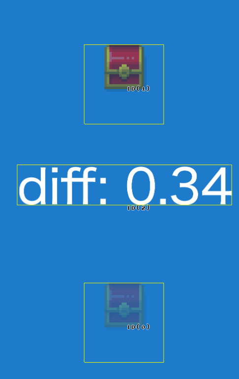

The simple alpha-adjust game.
When you think the 2 images have same alpha, just tap!!

Credits are as follows.

| item (description) | author         | URL                                                    |
| :----------------: | :------------- | :----------------------------------------------------- |
|  mapchip graphics  | ぴぽや         | <https://pipoya.net/>                                  |
| original examples  | digitsensitive | <https://github.com/digitsensitive/phaser3-typescript> |

### asteroid

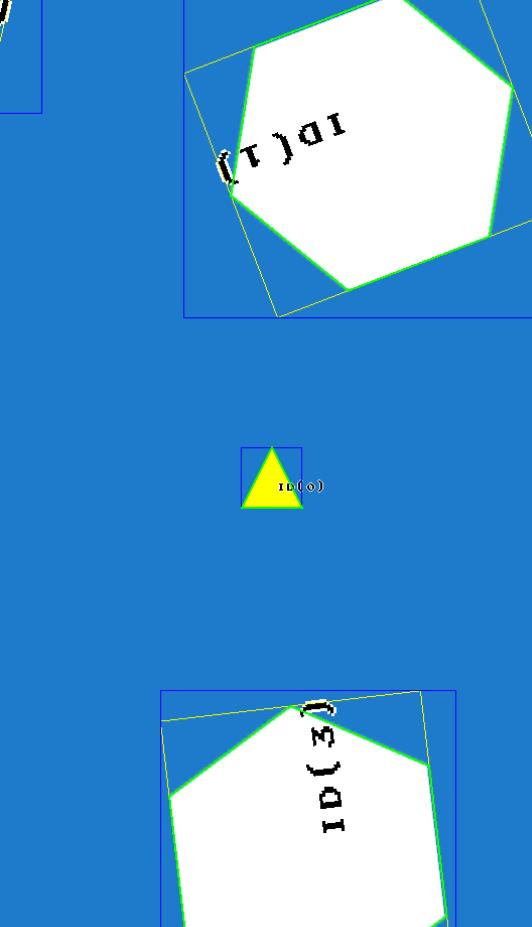

The asteroid game.

|      control       | description            |
| :----------------: | :--------------------- |
|     tap center     | shoot and move forward |
| tap the right side | turn right             |
| tap the left side  | turn left              |

Credits are as follows.

| item (description) | author         | URL                                                    |
| :----------------: | :------------- | :----------------------------------------------------- |
| original examples  | digitsensitive | <https://github.com/digitsensitive/phaser3-typescript> |

### bounce

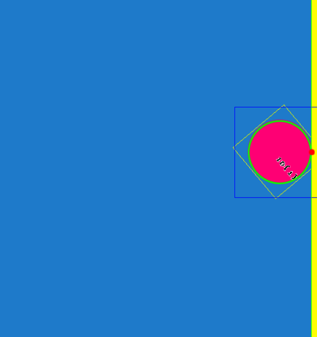

Demo for `Physics` .

### bowman

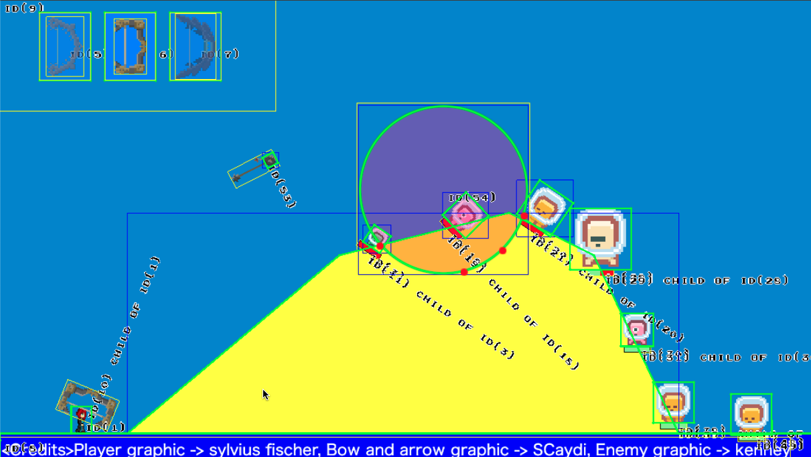

Demo game.
Drag and drop to shoot the arrow!!

Credits are as follows.

|  item (description)   | author          | URL                                                       |
| :-------------------: | :-------------- | :-------------------------------------------------------- |
|    player graphic     | sylvius fischer | <https://opengameart.org/content/fumiko-complete-charset> |
| bow and arrow graphic | SCaydi          | <https://opengameart.org/content/archer-job-set>          |
|     enemy graphic     | kenney.nl       | <https://www.kenney.nl/>                                  |

### breakout


The breakout game.
Drag to move the bar.

Credits are as follows.

| item (description) | author      | URL                                            |
| :----------------: | :---------- | :--------------------------------------------- |
| original examples  | excaliburjs | <https://excaliburjs.com/docs/getting-started> |

### click-reactions

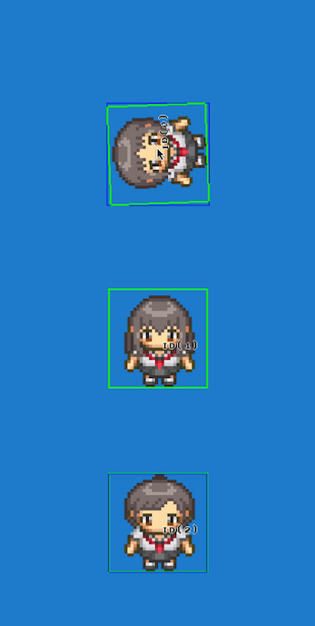

Demo for `Actions` .

Credits are as follows.

| item (description) | author | URL                   |
| :----------------: | :----- | :-------------------- |
| character graphics | ぴぽや | <https://pipoya.net/> |

### clocks

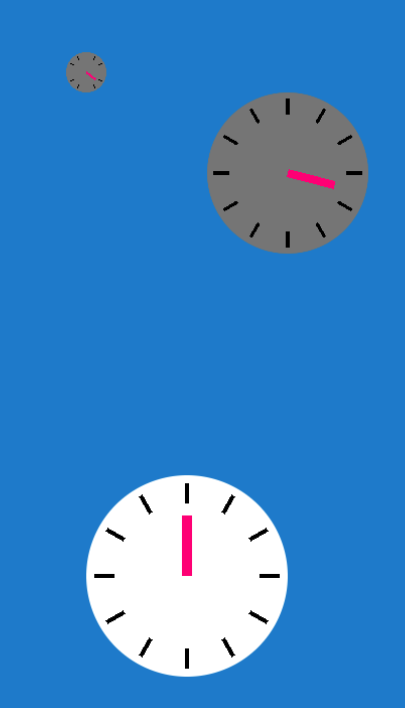

The simple tapping game which theme is clock.

Credits are as follows.

| item (description) | author         | URL                                                    |
| :----------------: | :------------- | :----------------------------------------------------- |
| original examples  | digitsensitive | <https://github.com/digitsensitive/phaser3-typescript> |

### detect-ground

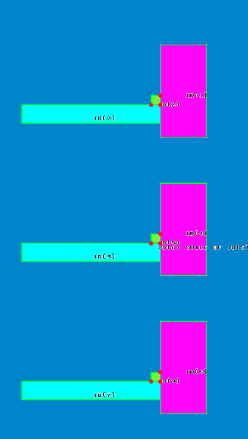

It shows how to detect ground in some patterns.

| item (description) | author                       | URL                                                         |
| :----------------: | :--------------------------- | :---------------------------------------------------------- |
|   original idea    | excalibur discussions (erik) | <https://github.com/excaliburjs/Excalibur/discussions/2406> |

### doll-stamper

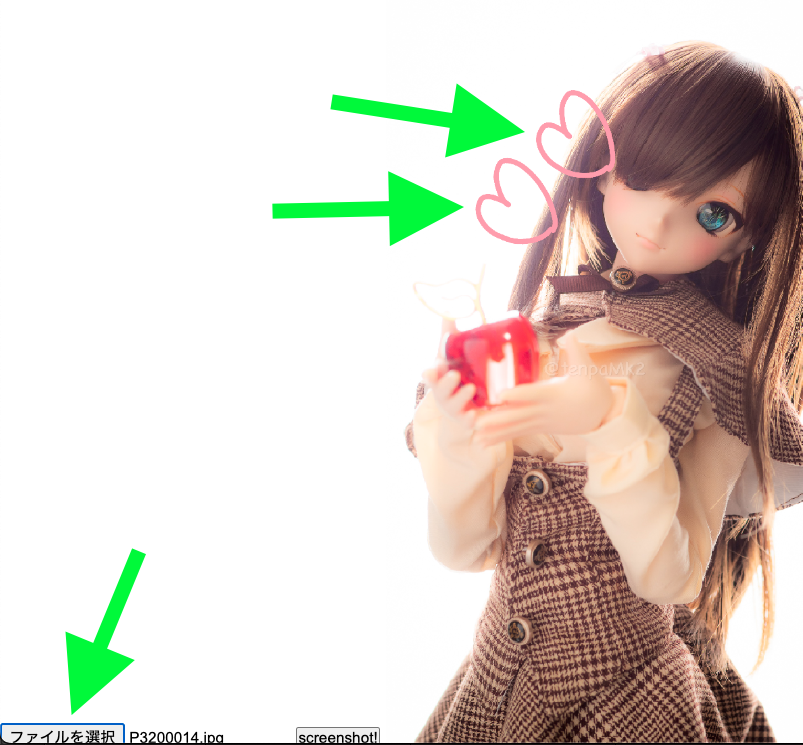

The application for adding 💗 to your cute dolls!!
It also the demo for dynamic image uploading.

### dungeon-generator

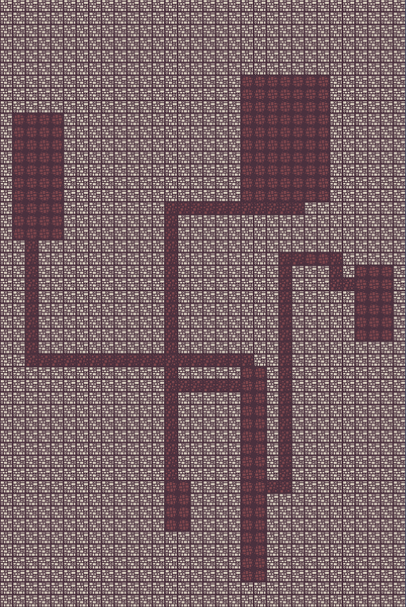

Random dungeon generator for rogue-like games!!

| item (description) | author    | URL                                     |
| :----------------: | :-------- | :-------------------------------------- |
|  mapchip graphics  | kenney.nl | <https://www.kenney.nl/assets/bit-pack> |

### event

Demo for custom events.

Credits are as follows.

### lockon

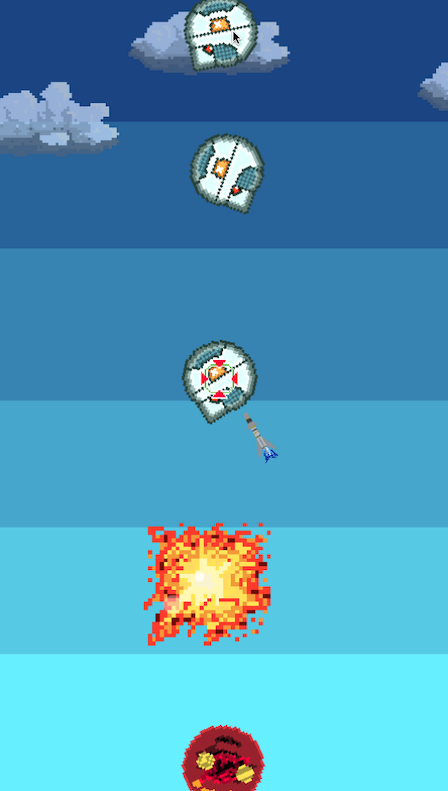

The simple tapping game.
After tapping or dragging on enemies, you can launch missiles!!

### mass-physics

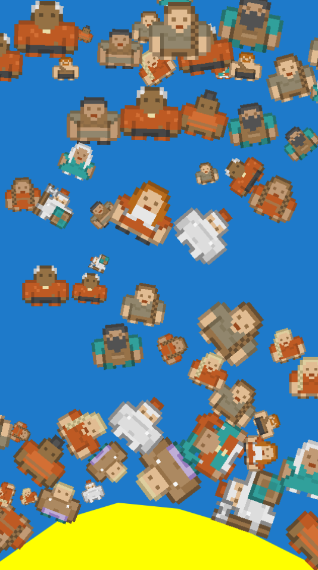

Demo for `Physics` .

Credits are as follows.

| item (description) | author    | URL                      |
| :----------------: | :-------- | :----------------------- |
| character graphics | kenney.nl | <https://www.kenney.nl/> |

### scene-change

Demo for scene-change.

### scroll-and-score-text

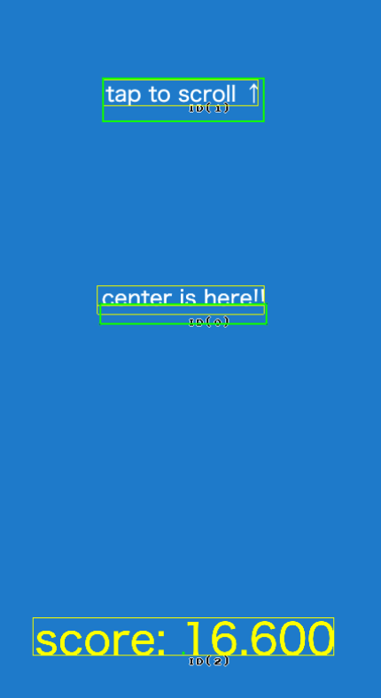

Demo for `ScreenElement` and `Camera` .

### slingshot

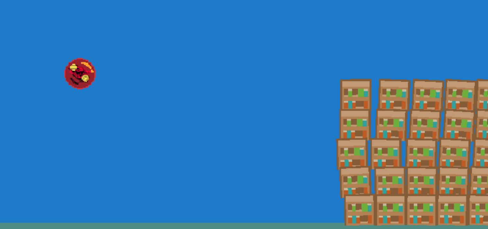

Demo for `Physics` .

Credits are as follows.

| item (description) | author    | URL                      |
| :----------------: | :-------- | :----------------------- |
|    box graphics    | kenney.nl | <https://www.kenney.nl/> |

### snake

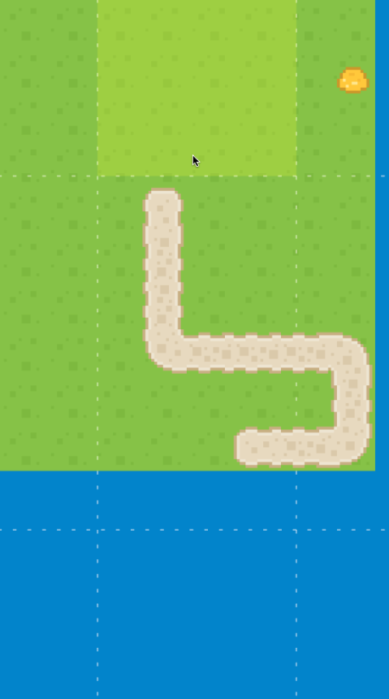

Simple snake game.
You can control the snake by tapping on edge of screen.

Credits are as follows.

| item (description) | author    | URL                      |
| :----------------: | :-------- | :----------------------- |
|      graphics      | kenney.nl | <https://www.kenney.nl/> |

### sound

Simple sound demo.

Credits are as follows.

| item (description) | author    | URL                      |
| :----------------: | :-------- | :----------------------- |
|       sound        | kenney.nl | <https://www.kenney.nl/> |

### sprite-animations

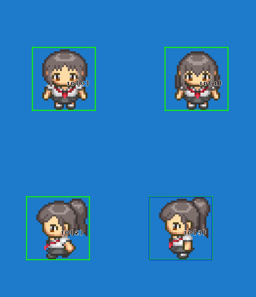

Demo for `Animations` .

Credits are as follows.

| item (description) | author | URL                   |
| :----------------: | :----- | :-------------------- |
| character graphics | ぴぽや | <https://pipoya.net/> |

### tilemap


Demo for `Tilemap` .
It also implements basic rogue-like component.

Credits are as follows.

| item (description) | author    | URL                      |
| :----------------: | :-------- | :----------------------- |
|  mapchip graphics  | kenney.nl | <https://www.kenney.nl/> |
| character graphics | kenney.nl | <https://www.kenney.nl/> |
