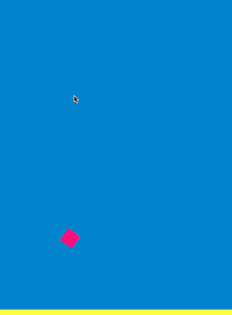
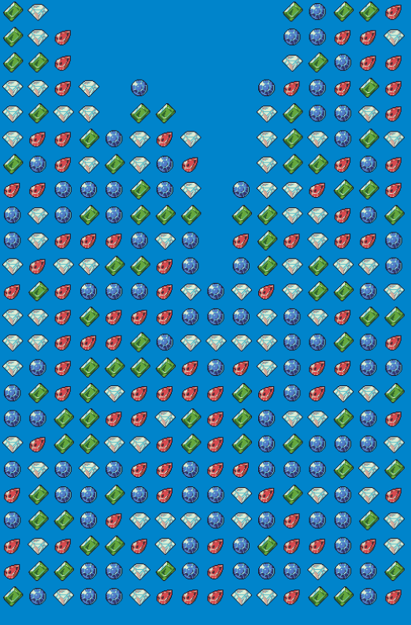

# excaliburjs-examples

This repository is collection of
[Excalibur.js](https://excaliburjs.com/)
examples.

## Breaking Changes Since 2023-07-15💥

- The repository is now a monorepo.
- The build environment was changed from Parcel to Vite.

## Get Started🚀

```shell
npm run {{foobar}}
```

See the `scripts` section in the `package.json` about `{{foobar}}` .

## Debug By VSCode🐛

If you want to set the break point on the VSCode,
~~See the my~~
~~[template](https://github.com/tenpaMk2/excalibur-parcel2-vscode-debuggable-template)~~
~~repository.~~

~~You need to copy `.vscode/launch.json` from my~~
~~[template](https://github.com/tenpaMk2/excalibur-parcel2-vscode-debuggable-template)~~
~~to each examples directory.~~
~~And open it by VSCode.~~

Use the following `launch.json` .

```json
{
  // Use IntelliSense to learn about possible attributes.
  // Hover to view descriptions of existing attributes.
  // For more information, visit: https://go.microsoft.com/fwlink/?linkid=830387
  "version": "0.2.0",
  "configurations": [
    {
      "type": "chrome",
      "request": "launch",
      "name": "Launch Chrome against localhost",
      "url": "http://localhost:5173",
      "webRoot": "${workspaceFolder}/foobar-examples/foobar/"
    }
  ]
}
```

Change port number, `foobar-examples` , and `foobar` as appropriate.
You can confirm the port number by `npm run {{foobar}}` .

## API Examples🍏

These examples are for testing Excalibur.js API.

### bounce


Example for `Physics` .

### click-reactions


Example for `Actions` .

Credits are as follows.

| item (description) | author | URL                   |
| :----------------: | :----- | :-------------------- |
| character graphics | ぴぽや | <https://pipoya.net/> |

### detect-ground


Example for detecting ground in some patterns.

| item (description) | author                       | URL                                                         |
| :----------------: | :--------------------------- | :---------------------------------------------------------- |
|   original idea    | excalibur discussions (erik) | <https://github.com/excaliburjs/Excalibur/discussions/2406> |

### event

Example for custom events.

### inputs



Example for keyboard inputs.
See the sourcecode for controls.

### mass-physics


Example for testing performance of `Physics` .

Credits are as follows.

| item (description) | author    | URL                      |
| :----------------: | :-------- | :----------------------- |
| character graphics | kenney.nl | <https://www.kenney.nl/> |

### scene-change

Example for scene-change.

### scroll-and-score-text


Example for `ScreenElement` and `Camera` .

### slingshot


Demo for `Physics` .

Credits are as follows.

| item (description) | author    | URL                      |
| :----------------: | :-------- | :----------------------- |
|    box graphics    | kenney.nl | <https://www.kenney.nl/> |

### sound

Example for `Sound` .

Credits are as follows.

| item (description) | author    | URL                      |
| :----------------: | :-------- | :----------------------- |
|       sound        | kenney.nl | <https://www.kenney.nl/> |

### sprite-animations


Example for `Animations` .

Credits are as follows.

| item (description) | author | URL                   |
| :----------------: | :----- | :-------------------- |
| character graphics | ぴぽや | <https://pipoya.net/> |

## Game Examples🍎

These examples are simple games.

### alpha-adjust


Just tap when you think the 2 images have same alpha❗

Credits are as follows.

| item (description) | author         | URL                                                    |
| :----------------: | :------------- | :----------------------------------------------------- |
|  mapchip graphics  | ぴぽや         | <https://pipoya.net/>                                  |
| original examples  | digitsensitive | <https://github.com/digitsensitive/phaser3-typescript> |

### asteroid


Shoot and break the asteroids❗

|      control       | description            |
| :----------------: | :--------------------- |
|     tap center     | shoot and move forward |
| tap the right side | turn right             |
| tap the left side  | turn left              |

Credits are as follows.

| item (description) | author         | URL                                                    |
| :----------------: | :------------- | :----------------------------------------------------- |
| original examples  | digitsensitive | <https://github.com/digitsensitive/phaser3-typescript> |

### bowman


Drag and drop to shoot the arrow❗

Credits are as follows.

|  item (description)   | author          | URL                                                       |
| :-------------------: | :-------------- | :-------------------------------------------------------- |
|    player graphic     | sylvius fischer | <https://opengameart.org/content/fumiko-complete-charset> |
| bow and arrow graphic | SCaydi          | <https://opengameart.org/content/archer-job-set>          |
|     enemy graphic     | kenney.nl       | <https://www.kenney.nl/>                                  |

### breakout


Break the blocks❗

Move the mouse to move the bar.

Credits are as follows.

| item (description) | author      | URL                                            |
| :----------------: | :---------- | :--------------------------------------------- |
| original examples  | excaliburjs | <https://excaliburjs.com/docs/getting-started> |

### clocks


Tap when the hands of the clock face the next clock❗

Credits are as follows.

| item (description) | author         | URL                                                    |
| :----------------: | :------------- | :----------------------------------------------------- |
| original examples  | digitsensitive | <https://github.com/digitsensitive/phaser3-typescript> |

### doll-stamper


This is not game but application.
Adding 💗 to your uploaded cute dolls photographs❗

It is also an example of dynamic image uploading.

### dungeon-generator


Random dungeon generator for rogue-like games❗

| item (description) | author    | URL                                     |
| :----------------: | :-------- | :-------------------------------------- |
|  mapchip graphics  | kenney.nl | <https://www.kenney.nl/assets/bit-pack> |

### lockon


Tap and drag the enemy, release, and then fire a missile❗

### samegame



Tap the same gems and try to clear all gems❗

Credits are as follows.

| item (description) | author          | URL                                         |
| :----------------: | :-------------- | :------------------------------------------ |
|    gem graphics    | Clint Bellanger | <https://opengameart.org/content/gem-icons> |

### snake


Gather food and avoid walls and your own body❗

You can control the snake by tapping on edge of screen.

Credits are as follows.

| item (description) | author    | URL                      |
| :----------------: | :-------- | :----------------------- |
|      graphics      | kenney.nl | <https://www.kenney.nl/> |

### tilemap


Example of roguelike game.
It is also an example of `Tilemap` .

You can control the player by tapping on edge of screen.

Credits are as follows.

| item (description) | author    | URL                      |
| :----------------: | :-------- | :----------------------- |
|  mapchip graphics  | kenney.nl | <https://www.kenney.nl/> |
| character graphics | kenney.nl | <https://www.kenney.nl/> |
