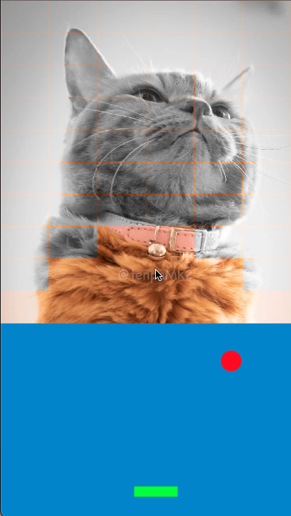
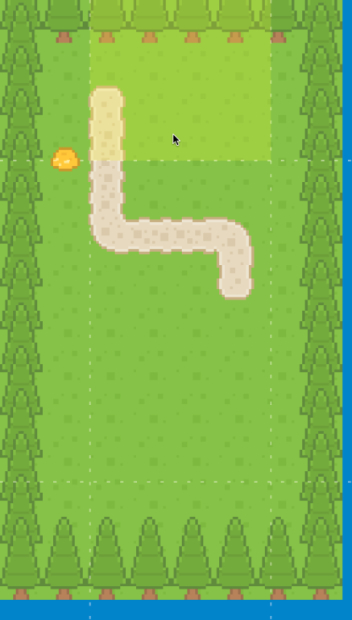
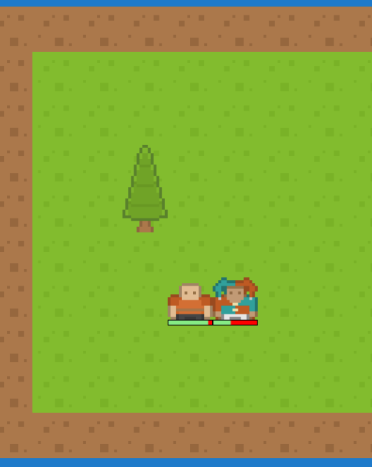

# excaliburjs-examples

[Excalibur](https://excaliburjs.com/)
examples (just demos and demo-games).

## How to play

```shell
npm run {{foobar}}
```

See the `scripts` section in the `package.json` about `{{foobar}}` .

## how to debug by VSCode

If you want to set the break point on the VSCode,
See the my
[template](https://github.com/tenpaMk2/excalibur-parcel2-vscode-debuggable-template)
repository.

You need to copy `.vscode/launch.json` from my
[template](https://github.com/tenpaMk2/excalibur-parcel2-vscode-debuggable-template)
to each examples directory.
And open it by VSCode.

## demos

### alpha-adjust


The simple alpha-adjust game.
When you think the 2 images have same alpha, just tap!!

Credits are as follows.

| item (description) | author         | URL                                                    |
| :----------------: | :------------- | :----------------------------------------------------- |
|  mapchip graphics  | ぴぽや         | <https://pipoya.net/>                                  |
| original examples  | digitsensitive | <https://github.com/digitsensitive/phaser3-typescript> |

### asteroid


The asteroid game.

|      control       | description            |
| :----------------: | :--------------------- |
|     tap center     | shoot and move forward |
| tap the right side | turn right             |
| tap the left side  | turn left              |

Credits are as follows.

| item (description) | author         | URL                                                    |
| :----------------: | :------------- | :----------------------------------------------------- |
| original examples  | digitsensitive | <https://github.com/digitsensitive/phaser3-typescript> |

### breakout



The breakout game.
Drag to move the bar.

Credits are as follows.

| item (description) | author      | URL                                            |
| :----------------: | :---------- | :--------------------------------------------- |
| original examples  | excaliburjs | <https://excaliburjs.com/docs/getting-started> |

### click-reactions


Demo for `Actions` .

Credits are as follows.

| item (description) | author | URL                   |
| :----------------: | :----- | :-------------------- |
| character graphics | ぴぽや | <https://pipoya.net/> |

### clocks


The simple tapping game which theme is clock.

Credits are as follows.

| item (description) | author         | URL                                                    |
| :----------------: | :------------- | :----------------------------------------------------- |
| original examples  | digitsensitive | <https://github.com/digitsensitive/phaser3-typescript> |

### lockon


The simple tapping game.
After tapping or dragging on enemies, you can launch missiles!!

### mass-physics


Demo for `Physics` .

Credits are as follows.

| item (description) | author   | URL                      |
| :----------------: | :------- | :----------------------- |
| character graphics | kenny.nl | <https://www.kenney.nl/> |

### no-bounce-at-0.25.3


Demo for `Physics` .

### scroll-and-score-text


Demo for `ScreenElement` and `Camera` .

### slingshot


Demo for `Physics` .

Credits are as follows.

| item (description) | author   | URL                      |
| :----------------: | :------- | :----------------------- |
|    box graphics    | kenny.nl | <https://www.kenney.nl/> |

### snake



Simple snake game.
You can control the snake by tapping on edge of screen.

Credits are as follows.

| item (description) | author   | URL                      |
| :----------------: | :------- | :----------------------- |
|      graphics      | kenny.nl | <https://www.kenney.nl/> |

### sprite-animations


Demo for `Animations` .

Credits are as follows.

| item (description) | author | URL                   |
| :----------------: | :----- | :-------------------- |
| character graphics | ぴぽや | <https://pipoya.net/> |

### tilemap



Demo for `Tilemap` .
It also implements basic rogue-like component.

Credits are as follows.

| item (description) | author   | URL                      |
| :----------------: | :------- | :----------------------- |
|  mapchip graphics  | kenny.nl | <https://www.kenney.nl/> |
| character graphics | kenny.nl | <https://www.kenney.nl/> |
